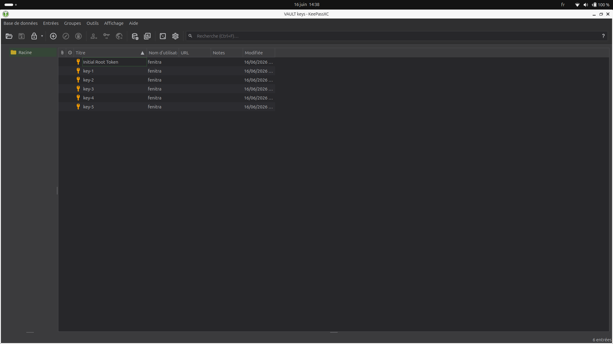
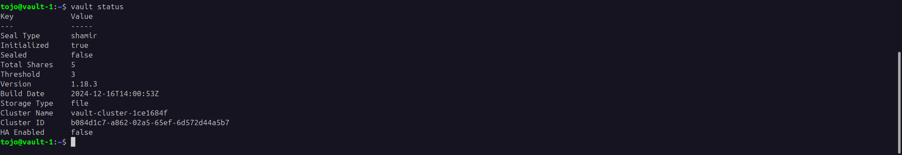

# CANARY DEPLOYMENT AND VAULT

This project try to simulate an infrastructure like production ready, so all the user are supose to be real.

| USER | GROUP | DESCRIPTION |
| ---- | ---- | ---- |
| Ansible | ansible, root | service account for ansible-playbook client |
| Fenitra | admin, root | account for system administrator |
| Tojo | devops, adm | account for devops engineer with limited autorisation |

### CONFIGURATION FOR HOST
Inside the host, we should create key ssh for all user account and copy in `$HOME/.ssh/config` file.

```bash
cd /script
chmod +x key-gen.sh
./key-gen.sh
```

And then we can create our servers using vagrant. Inside this vagrantfile, there's a script `config-server.py` that config automatically all user account for all existing servers.
```bash
vagrant up
```
Script python outputs:


After all of this config, we can intercat with VM using `ssh + lab-username + server_name`.
For example:
```bash
ssh lab-fenitra-vault-1
```


All autorisation are set for user `Tojo` the devops engineer. So he can execute `systemctl` command but can't install new packages.


### VAULT CLUSTER CONFIGURATION

Firstly, we should install and configure vault service for `vault-1` server.

Vault installation using ansible playbooks:
```bash
ansible-playbook -i inventory.yml site.yml --tags vault-installation --limit vault-1
```


Use Tojo the devops user to configure the first server of our vault cluster.
```bash
ssh lab-tojo-vault-1
```

So we have vault installed within our server vault-1. Right now, we were trying to initialize our vault server using this command:
```bash
vault operator init
```

And the outputs give five `unseal keys` and one `initial root token`. We should save all those keys using `KeePassXC` with linux.



And then, we use three for all those five keys with executing this command three times:
```bash
vault operator unseal
```
> Unseal Key (will be hidden): enter the unseal keys.

To be able for modify all configurations, we should log as administrator.
```bash
vault login
```
> Token (will be hidden): enter the initial root token.

Our vault server is initialized!!

Verification:
```bash
vault status
```
