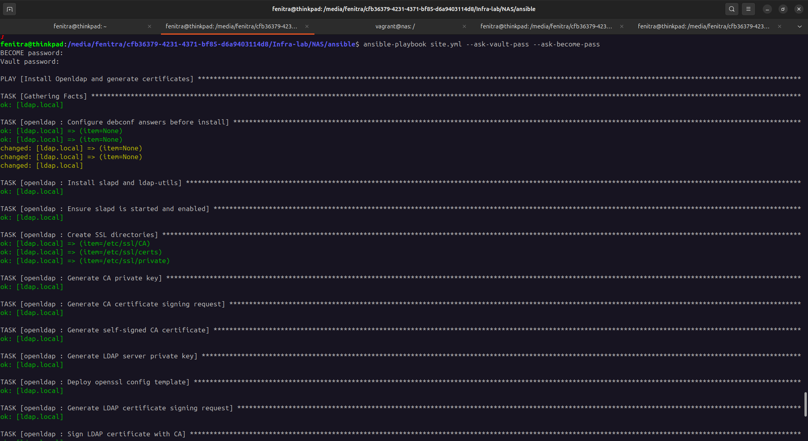

# NETWORK ATTACHED STORAGE (NAS)

## Network Topology


## Vagrant Configuration
Create all 3 disks vmdk
```sh
for i in {1..3}; do
vmware-vdiskmanager -c -s 3GB -a lsilogic -t 2 disque$i.vmdk
done
vagrant plugin install vagrant-disksize
```
Launch all VMs
```
vagrant up
```
So you have 3 VMs in VMware Player:


You can access all VMs using ssh
```
vagrant ssh ldap
vagrant ssh nas
vagrant ssh backup
```
Verify if all disk are recognized by nas server


## LDAP Configuration

Directory Information Tree (DIT)


Create ansible/group_vars/ldap/vault.yml
```
ldap_admin_password: your password
```
and encrypt it:
```
ansible-vault encrypt group_vars/ldap/vault.yml
```
Execute the scipt to automate ldif configurations
``` 
cd /vagrant/ldap
chmod +x ./ldapadd_script.sh
./ldapadd_script.sh
```

launch ansible-playbook
```
ansible-playbook site.yml --ask-vault-pass --ask-become-pass
```

