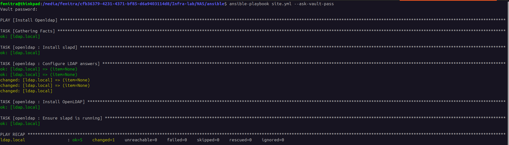

# NETWORK ATTACHED STORAGE (NAS)

## Vagrant Configuration
Create all 3 disks vmdk
```sh
for i in {1..3}; do
vmware-vdiskmanager -c -s 3GB -a lsilogic -t 2 disque$i.vmdk
done
vagrant plugin install vagrant-disksize
```
Launch all VMs
```
vagrant up
```
## Ansible Configuration
Create ansible/group_vars/vault.yml
```
ldap_admin_password: your password
```
and encrypt it:
```
ansible-vault encrypt group_vars/vault.yml
```
launch ansible-playbook
```
ansible-playbook site.yml --ask-vault-pass
```

