# NETWORK ATTACHED STORAGE (NAS)

## Network Topology


## Vagrant Configuration

Create all 3 disks vmdk

```sh
for i in {1..3}; do
vmware-vdiskmanager -c -s 3GB -a lsilogic -t 2 disque$i.vmdk
done
vagrant plugin install vagrant-disksize
```

Launch all VMs

```
vagrant up
```
So you have 3 VMs in VMware Player:

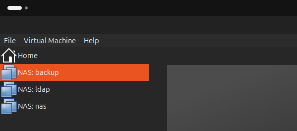


You can access all VMs using ssh
```
vagrant ssh ldap
vagrant ssh nas
vagrant ssh backup
```
Verify if all disk are recognized by nas server

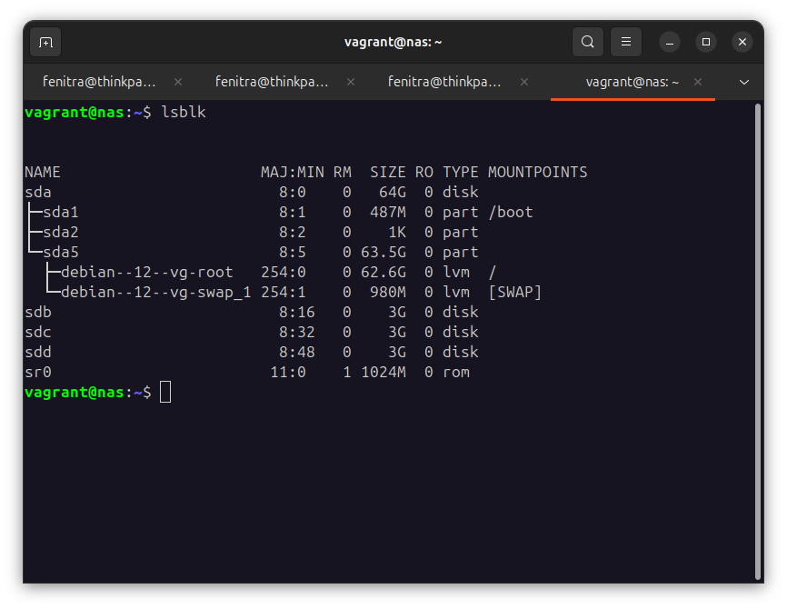


## NB: ALL ANSIBLE PLAYBOOKS ARE EXECUTED FROM HOST.

## LDAP server Configuration

Directory Information Tree (DIT)

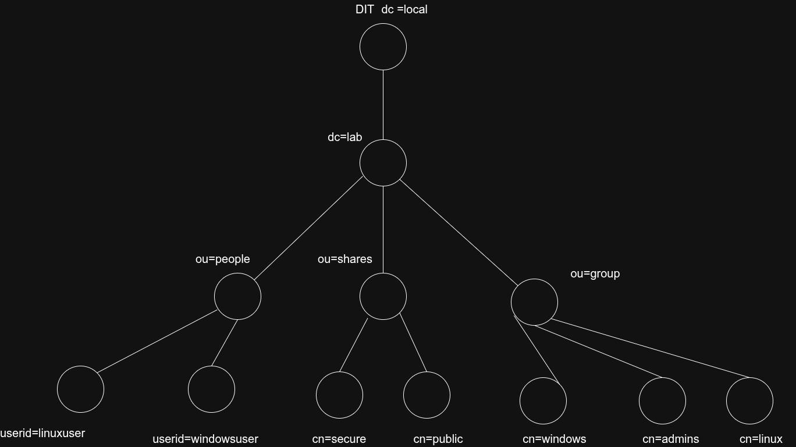

Create ansible/group_vars/ldap/vault.yml
```
ldap_admin_password: your password
vault_linuxuser_password: linuxpassword
vault_windowsuser_password: windowspassword
```
and encrypt it:
```
ansible-vault encrypt group_vars/ldap/vault.yml
```

launch ansible-playbook

```
ansible-playbook site.yml --ask-vault-pass --tags openldap
```
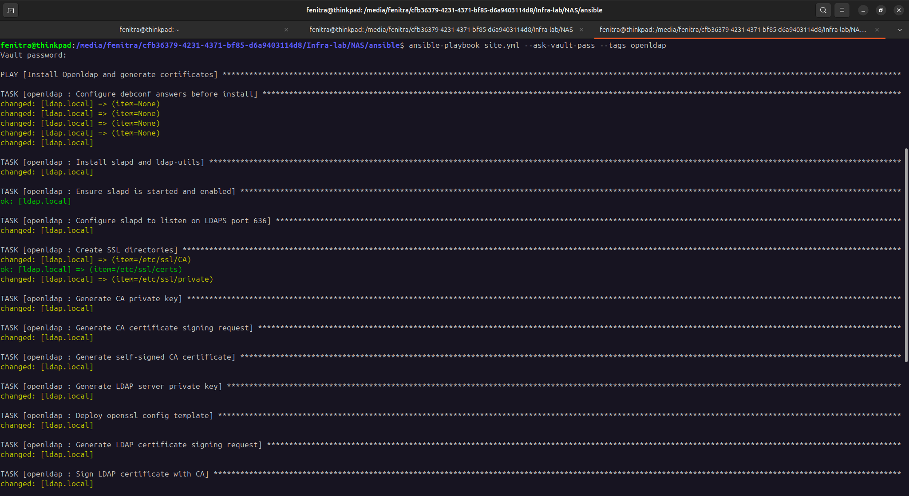


Execute the scipt to automate ldif configurations
``` 
cd /vagrant/ldap
chmod +x ./ldapadd_script.sh
./ldapadd_script.sh
```
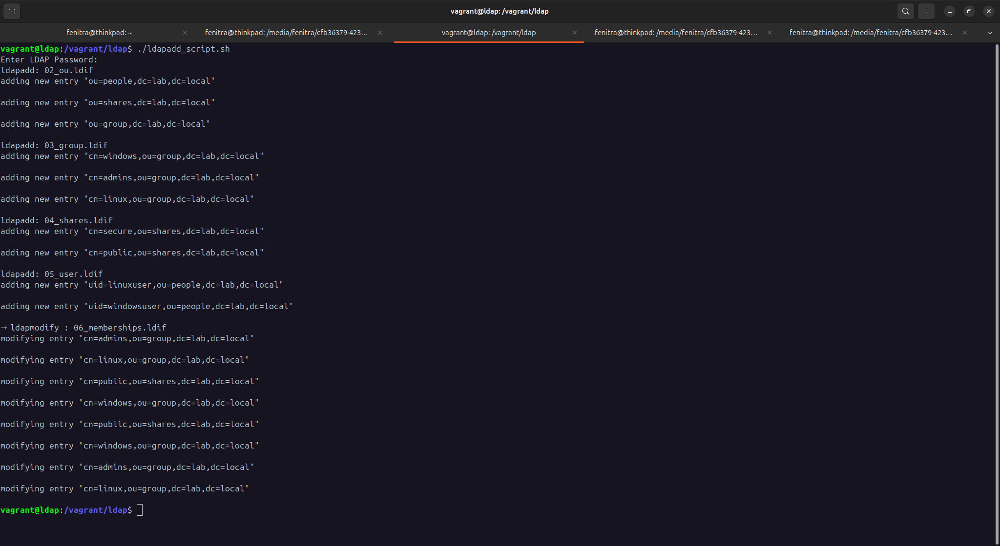

## NAS server Configurations

Firstly, we need to distribute and update CA certificate using this playbook's command.
```
ansible-playbook site.yml --ask-vault-pass --tags nas_ca_dist
```

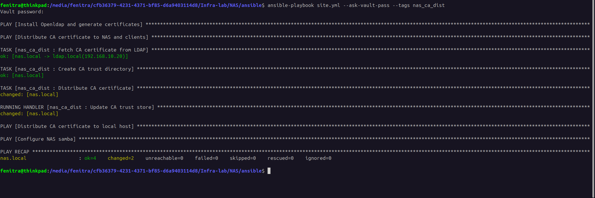

Then, install and configure samba so nas server can interact with ldap server and all client.

```
ansible-playbook site.yml --ask-vault-pass --tags nas_samba --asks-become-pass
```
> This playbook need privilege mode so using `--asks-become-pass` flag is necessary. By default, the password is: `vagrant`.

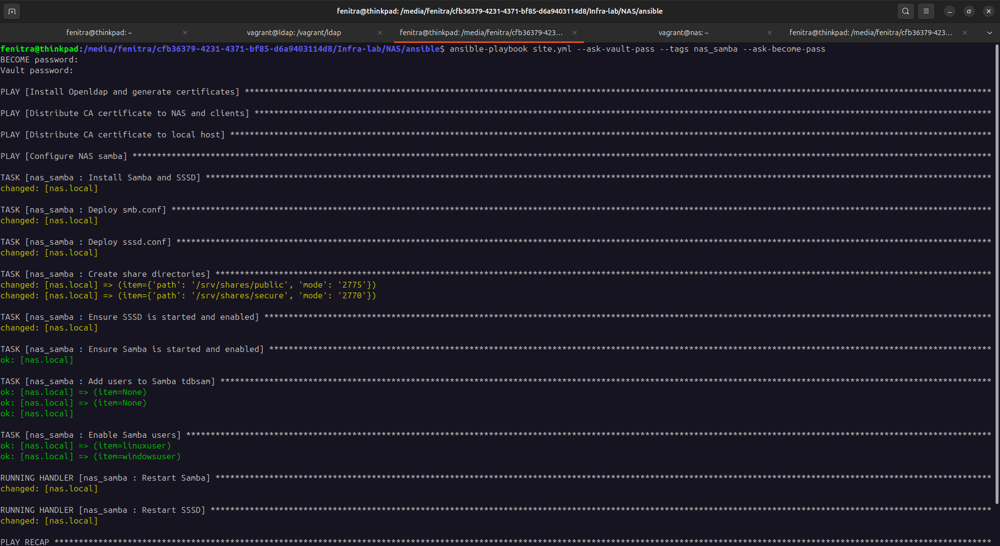

## RAID5 configuration at NAS sever

To create a RAID5 array, we should execute `mdadm --create` command and mention all devices.

```
sudo mdadm --create /dev/md0 --level=5 --raid-devices=3 /dev/sdb /dev/sdc /dev/sdd
```
And monitor the progress of creation by checking `/proc/mdstat`.

```
cat /proc/mdstat
```
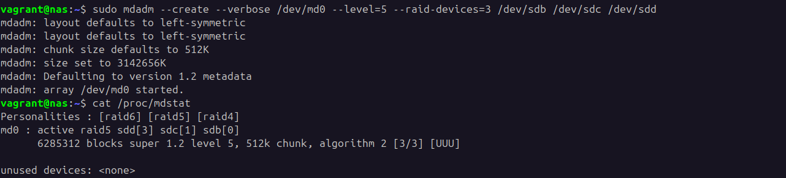

> UUU means all disks are up(OK).

Next, we create an ext4 filesystem on the array and mount it at `/srv/shares`. And we should have new filesystem with size &approx; 6G.

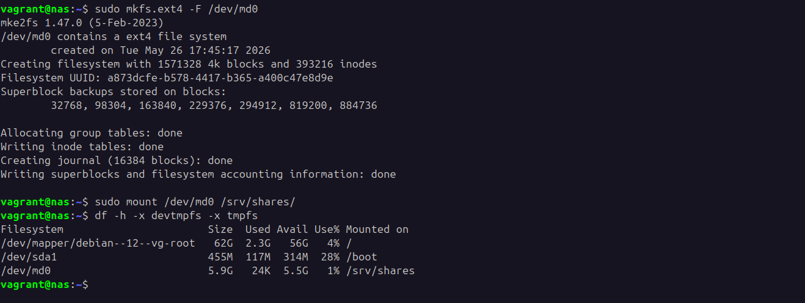

> 6G because of the rule of RAID 5: (N-1) x size of smallest disk.  

To save all configurations that we made, we should write the array definition, and it's `UUID` to `/etc/mdadm/mdadm.conf`. Then, update initramfs so it doesn't reflect the old configuration.

```
sudo mdadm --detail --scan | sudo tee -a /etc/mdadm/mdadm.conf
sudo update-initramfs -u
```
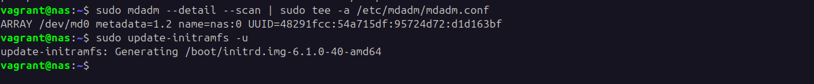

It will not mount automatically our new filesystem at boot, so entry `nofail` at `/etc/fstab` tells the OS to mount the array after it assembles.


## Test from linux client (HOST)

For test, we use `smbclient` like tools to interact with NAS server at `//192.168.10.10/public` that all user can access. And we create `test` directory.

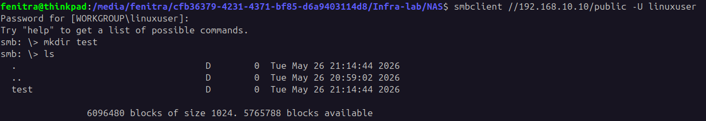

If we list all directories at `/srv/shares/public` from NAS server, the `test` directory appeared.

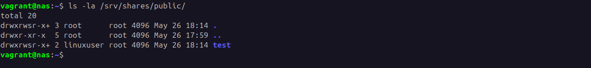

## VPN site-to-site configuration

For VPN server, we use [wireguard](https://www.wireguard.com/install/) and configure it from HOST and windows client.
Firstly, we need to create all `private` and `public` keys from VPN server (HOST).

```
wg genkey | tee private.key | wg pubkey > public.key
cat private.key
cat public.key
```
And use those to configure `/etc/wireguard/wg0.conf` file.

```
[Interface]
Address    = 10.8.0.1/24
PrivateKey = <linux_private_key>
ListenPort = 51820

PostUp   = iptables -A FORWARD -i wg0 -j ACCEPT
PostUp   = iptables -A FORWARD -o wg0 -j ACCEPT
PostUp   = iptables -t nat -A POSTROUTING -s 10.8.0.0/24 -o vmnet2 -j MASQUERADE
PostDown = iptables -D FORWARD -i wg0 -j ACCEPT
PostDown = iptables -D FORWARD -o wg0 -j ACCEPT
PostDown = iptables -t nat -D POSTROUTING -s 10.8.0.0/24 -o vmnet2 -j MASQUERADE

[Peer]
PublicKey  = <windows_public_key>
AllowedIPs = 10.8.0.2/32
```
Active `wg0` interface with this command.

```
sudo wg-quick up wg0
```

From windows, we can use GUI for configuration.

```
[Interface]
Address    = 10.8.0.2/24
PrivateKey = <windows_private_key>

[Peer]
PublicKey  = <linux_public_key>
Endpoint   = <VPN_server_IP>:51820
AllowedIPs = 192.168.10.0/24     
PersistentKeepalive = 25
```
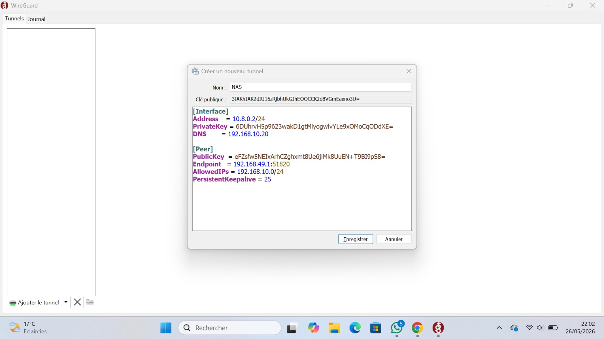

And activate it using GUI.

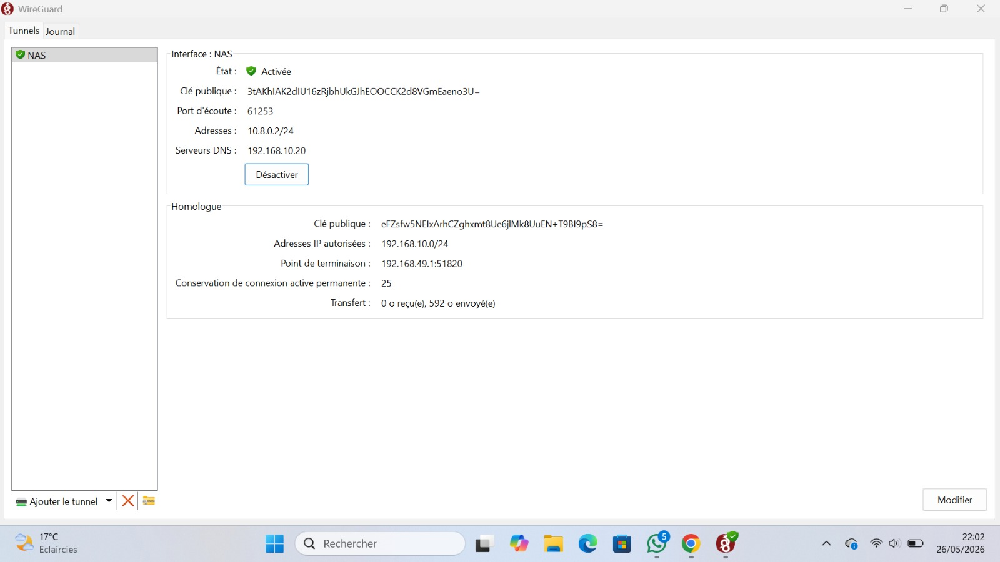

After all these configs, we can use `cmd` to interact with NAS sever using this command. And then, `test` directory appeared.

```
net use Z: \\192.168.10.10\public /user:windowsuser *
```
> Enter your windows user password. Mine is appeared within screenshot XD.

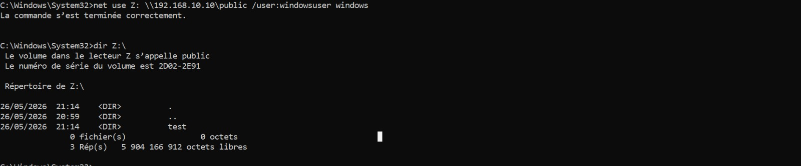

Finally, we can use Windows explorer for best view XD.

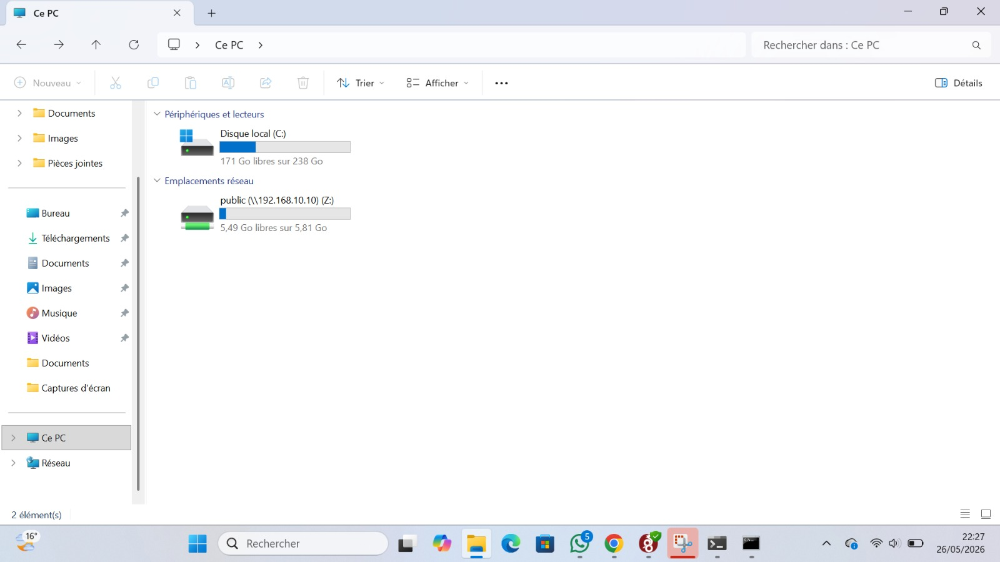