# CI/CD Pipeline with Dynamic Kubernetes Agents

It's part of my intership project with complete Continuous Integration and Deployment pipeline for the **volet-0** Next.js frontend, orchestrated by Jenkins using **ephemeral agents dynamically provisioned inside Kubernetes** (Kubernetes Plugin).

### Pipeline Flow

```
GitHub Push
    │
    ▼
Jenkins (master)
    │  triggers
    ▼
Ephemeral K8s Agent Pod
    ├── Container: jnlp          → Jenkins communication
    ├── Container: node-linter   → npm ci, npm run build
    ├── Container: docker-cli    → docker build & push → GHCR
    └── Container: kubectl       → kubectl set image → namespace dev
    │
    ▼
Email Notification (success / failure)
```


## Project Architecture

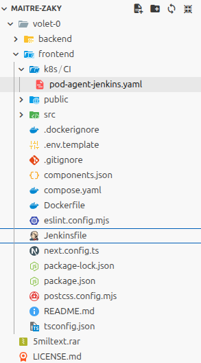


## Prerequisites

| Component | Recommended Version |
|-----------|---------------------|
| Kubernetes | ≥ 1.24 |
| Jenkins | ≥ 2.400 (with Kubernetes Plugin) |
| Docker | ≥ 20.x |
| Node.js | 22.x (image `node:22.21-alpine`) |
| kubectl | latest (`lachlanevenson/k8s-kubectl`) |

**Required Jenkins Plugins:**
- Kubernetes Plugin
- Email Extension Plugin (`emailext`)
- Credentials Binding Plugin
- Pipeline Plugin

## Launch Jenkins service inside container

To simplify `Jenkins` setup, we use docker compose :

```bash
docker compose up -d
```

## Kubernetes Setup

### 1. Namespaces

Jenkins and its agents run in the `jenkins` namespace; the application is deployed to `dev`:

```bash
kubectl create namespace jenkins
kubectl create namespace dev
```

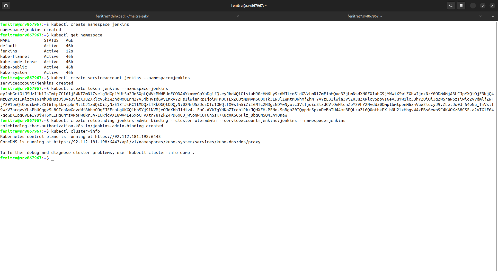

### 2. ServiceAccount & RBAC

A `static-sa` ServiceAccount is created in the `jenkins` namespace with `cluster-admin` rights so Jenkins can manage Kubernetes resources:

```yaml
apiVersion: v1
kind: ServiceAccount
metadata:
  name: static-sa
  namespace: jenkins
secrets:
  - name: static-sa-token
```

```yaml
apiVersion: rbac.authorization.k8s.io/v1
kind: ClusterRoleBinding
metadata:
  name: static-sa-admin
subjects:
  - kind: ServiceAccount
    name: static-sa
    namespace: jenkins
roleRef:
  kind: ClusterRole
  name: cluster-admin
  apiGroup: rbac.authorization.k8s.io
```

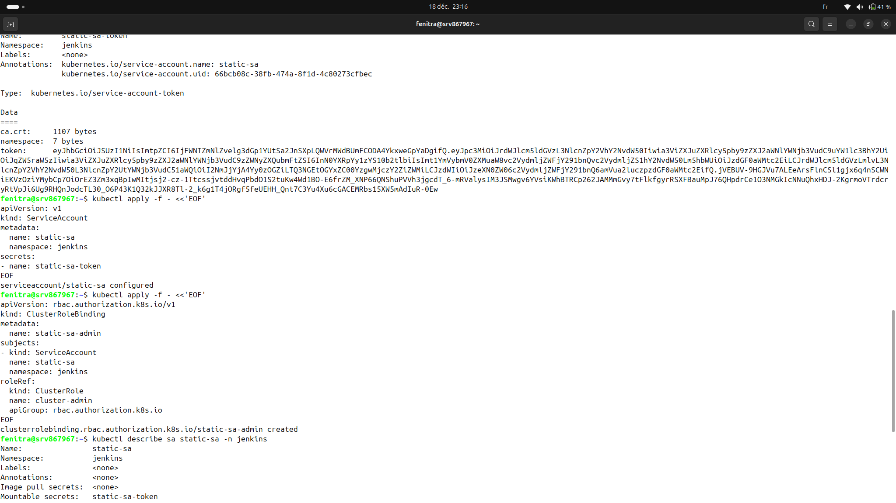

### 3. Dynamic Agent Pod (`pod-agent-jenkins.yaml`)

The file `k8s/CI/pod-agent-jenkins.yaml` defines the Pod created for every build. It contains **4 containers**:

| Container | Image | Role |
|-----------|-------|------|
| `jnlp` | `jenkins/inbound-agent:latest` | Communication with the Jenkins master |
| `node-linter` | `node:22.21-alpine` | Dependency installation & build |
| `kubectl` | `lachlanevenson/k8s-kubectl:latest` | Deployment to the cluster |
| `docker-cli` | `docker:29.1.1-cli` | Docker image build & push |

All containers share:
- A `workspace-volume` (emptyDir) for the source code
- The host Docker socket (`/var/run/docker.sock`) for Docker-in-Docker operations

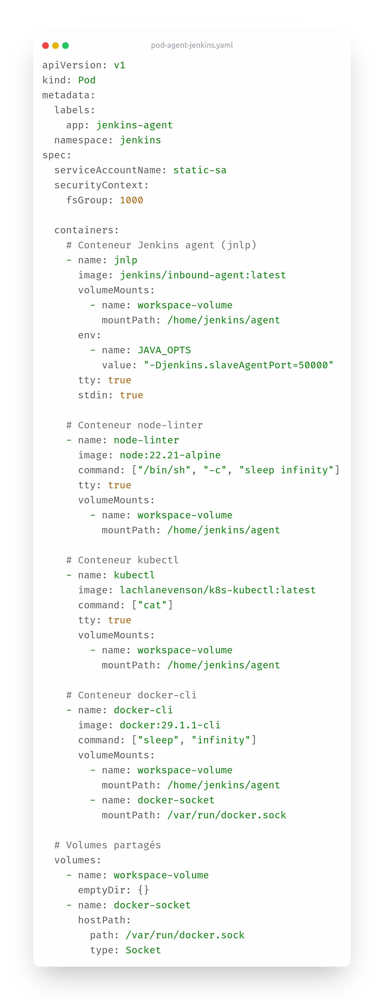

---

## Jenkins Configuration

### 1. Connecting to the Kubernetes Cluster

Kubernetes Cloud with:

- Name: `k8s-jenkins`
- Kubernetes URL your cluster API server URL
- Kubernetes Namespace `jenkins`
- Credentials `jenkins-token` (token of the `static-sa` ServiceAccount)

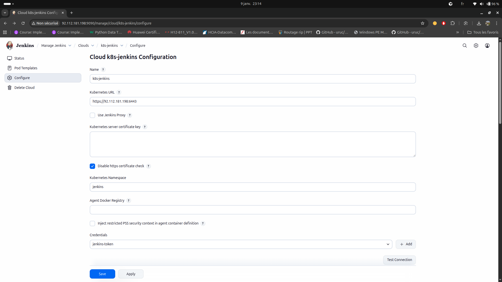

### 2. Required Credentials

| ID | Type | Purpose |
|----|------|---------|
| `git-https-token` | Username/Password | GitHub authentication + GHCR push |
| `email-token` | Username/Password | Email sending via Gmail SMTP |
| `jenkins-token` | Secret text | Kubernetes ServiceAccount token |

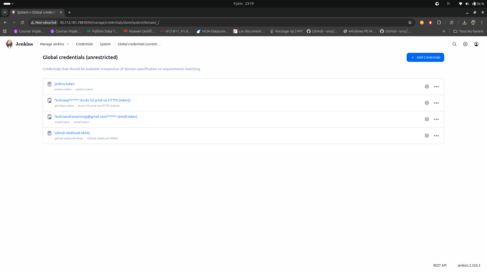

### 3. SMTP Configuration

For email notifications, configure the Gmail SMTP server under **Manage Jenkins → System → Extended E-mail Notification**:

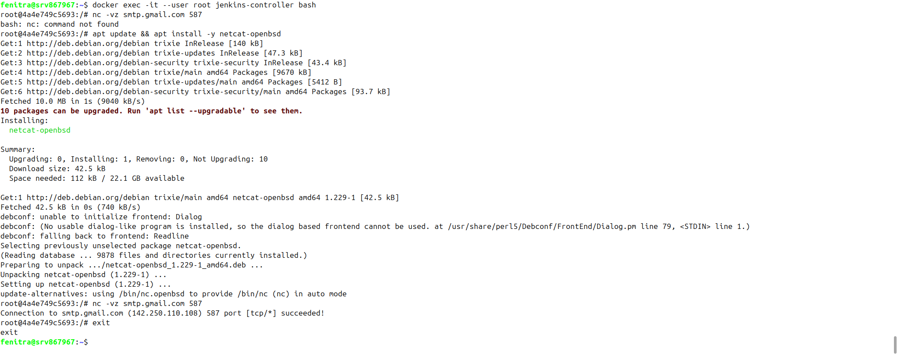

---

## CI/CD Pipeline

The `Jenkinsfile` defines a declarative pipeline with the following sections.

### Agent & Environment

The agent is driven by the Pod YAML file. The `jnlp` container is the default for any step that doesn't explicitly specify `container()`.

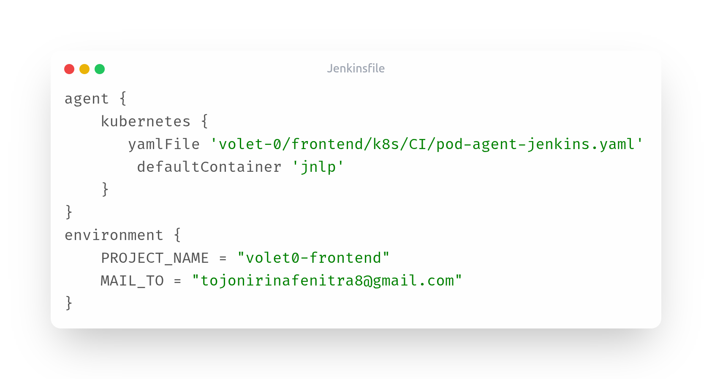

---

### Stage 1 — Clone the Project

The Docker image tag is derived from the **Git commit short SHA**, ensuring full traceability between the deployed image and the code that produced it.

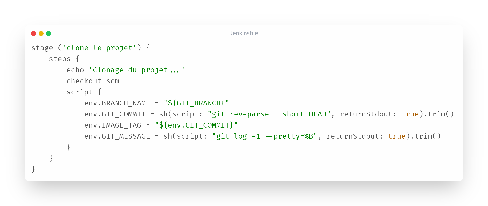

---

### Stage 2 — Install Dependencies

Runs inside the `node-linter` container (Node.js 22 Alpine). `npm ci` guarantees a reproducible install from `package-lock.json`.

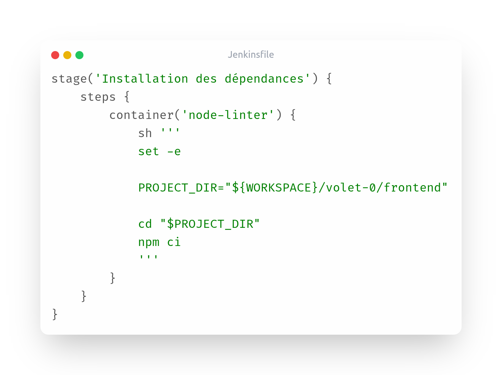

---

### Stage 3 — Build

Compiles the Next.js application in production mode.

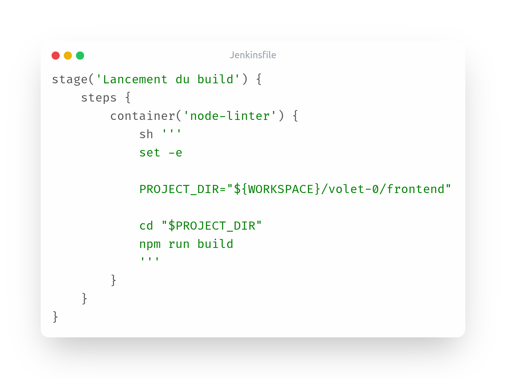

---

### Stage 4 — Docker Build & Push

The image is tagged with the commit SHA and pushed to **GitHub Container Registry (GHCR)**.

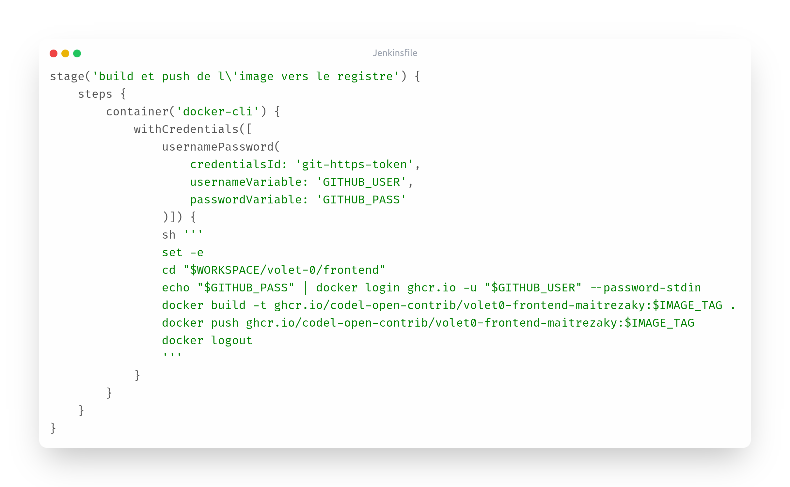

The published image as it appears in the GHCR registry:

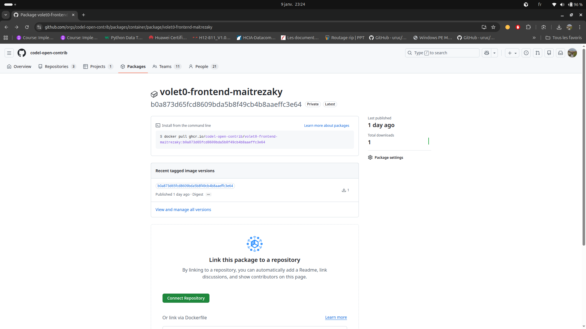

---

### Stage 5 — Deploy to Kubernetes

Updates the Deployment image in the `dev` namespace and waits for the rollout to complete before marking the stage as successful.

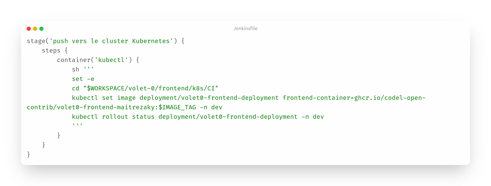

---

### Post — Email Notifications

At the end of every pipeline run (success or failure), an email is sent with build details:

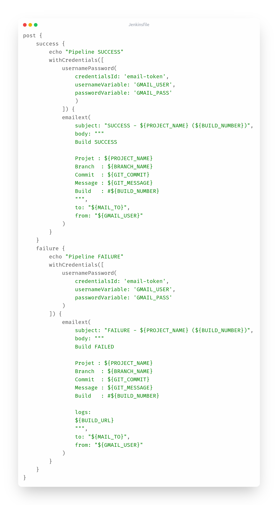

Example of a success notification email:

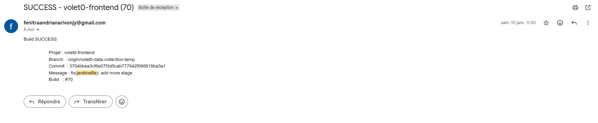

Example of Pipeline:

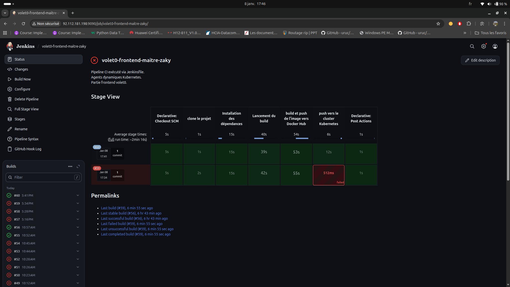