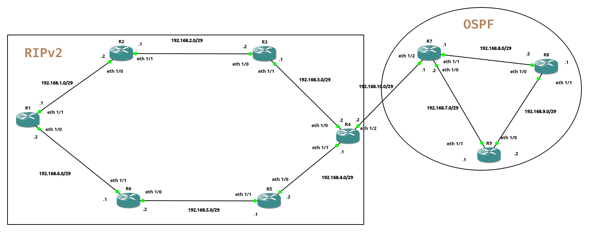

# Routing Information Protocol (RIPv2) and Open Shortest Path First (OSPF)

---

## Overview

This project presents the steps for implementing and analyzing the RIPv2 and OSPF routing protocols in a simulated environment using GNS3. The objective is to configure, observe, compare, and redistribute routes between the two protocols, while documenting the results and network behavior.

---

## Part 1: RIPv2

### 1. Topology

The network topology was built according to the project specifications, with 6 routers (R1 to R6) interconnected using the [Cisco c7200](https://github.com/fenitraaa/Infra-lab/raw/main/RIPv2-and-OSPF/c7200-adventerprisek9-mz.152-4.M7.bin) model.

---

### 2. Addressing Plan and Configuration

Each router interface was assigned an IP address from the `192.168.x.0/29` subnets.

---

### 3. Enabling RIP Version 2

RIPv2 was activated on all routers with `no auto-summary` to allow subnet-level advertisement.

---

### 4. Routing Table Analysis and Connectivity Tests

After convergence, all remote subnets appeared in each router's routing table marked `R` (RIP-learned).

---

### 5. Network Resilience Test (Link Failure)

The link between R2 and R3 was shut down to simulate a failure. RIPv2 automatically rerouted traffic through an alternate path.

---

### 6. Protocols and Ports Used by RIP

RIP uses **UDP on port 520** for both sending and receiving routing updates.

---

### 7. Observing RIP Traffic with Wireshark

After re-enabling the R2–R3 link, RIP traffic was captured with Wireshark. The metric of 4 reflects the hop count to reach 192.168.2.0 via the alternate path after link restoration.

---

### 8. Network Behavior After Removing R2

R2 was removed from the topology to observe how RIPv2 handles complete router loss. A metric of 16 indicates the route is unreachable.

**Reconvergence timeline observed in Wireshark:**

| Packet | Time | Event |
|--------|------|-------|
| #15 | 85s | Route to R3 becomes unreachable (metric 16) |
| #23 | 142s | R1 receives a new valid route to R3 |

**Reconvergence time: 142s - 85s = 57 seconds**

> R1 took 57 seconds to find a working path to R3 after the R2–R3 link was cut.

---

## Part 2: OSPF

### 1. Adding Loopback Interfaces

A loopback interface was configured on each OSPF router to serve as a stable Router ID (RID).

---

### 2. Addressing Plan and OSPF Configuration
R7:

-Capture%20d’écran%20du%202025-05-29%2022-01-49.png)
-Capture%20d’écran%20du%202025-05-29%2010-44-21.png)

R8:

-Capture%20d’écran%20du%202025-05-29%2010-42-39.png)

R9:

-Capture%20d’écran%20du%202025-05-29%2010-45-27.png)
---

### 3. OSPF Message Exchange

OSPF relies on several message types to establish and maintain communication between routers:

| Message | Description |
|---------|-------------|
| **Hello** | Sent on startup to discover neighbors and establish adjacencies |
| **Database Description (DBD)** | Exchanged to summarize each router's link-state database |
| **Link-State Request (LSR)** | Sent when a router detects missing information |
| **Link-State Update (LSU)** | Response containing the requested link-state information |
| **Link-State Acknowledgment (LSAck)** | Confirms receipt of each update |

---

### 4. Router Identifiers (RID)

The loopback interface IP address is used as the Router ID because it is considered more stable than a physical interface address.

| Router | RID |
|--------|-----|
| R7 | 1.1.1.1 |
| R8 | 2.2.2.2 |
| R9 | 3.3.3.3 |

---

### 5. Connectivity Tests

---

### 6. Route Redistribution Between RIP and OSPF

R4 acts as the boundary router between the RIPv2 and OSPF domains. New interfaces were added to connect both domains.

New interface configuration on R4 and R7:

OSPF activation on new interfaces:

**Observation before redistribution:**

R4 can ping R8's loopback (2.2.2.2) — success, because R4 already has an OSPF interface:

R8 cannot ping R4's interface connected to R3 — OSPF does not know RIP routes by default:
-Capture%20d’écran%20du%202025-05-29%2023-16-40.png)

R1 cannot ping R8, and R8 cannot ping R1 until redistribution is configured:

-Capture%20d’écran%20du%202025-05-29%2023-20-20.png)

**Routing tables of R1, R4, R8 before redistribution:**

-Capture%20d’écran%20du%202025-05-29%2023-24-29.png)

#### Redistributing RIP into OSPF (on R4)

After redistribution, a route toward R1 appears in R8's routing table.

-Capture%20d’écran%20du%202025-05-29%2023-32-23.png)

#### Redistributing OSPF into RIP (on R4)

R8 and R1 still cannot reach each other until OSPF is redistributed into RIP. A metric value must be specified during redistribution, otherwise routes do not propagate to RIP routers.

---

### 7. Final Connectivity Tests and Verifications

Tests of connectivity after complete redistribution.
The OSPF networks do not yet appear on the RIP routers because there was an issue with the command.
To fix the problem, the metric must be specified when redistributing OSPF at the R4 level.

After complete redistribution, all routers across both domains can communicate.

Example: ping from R9 to the Ethernet1/1 interface of R6

---

### 8. Final Topology

The complete topology after full configuration, showing both the RIPv2 and OSPF domains connected via R4.

| Domain | Routers | Subnets |
|--------|---------|---------|
| RIPv2 | R1, R2, R3, R4, R5, R6 | 192.168.1.0 – 192.168.6.0 /29 |
| OSPF | R4, R7, R8, R9 | 192.168.7.0 – 192.168.10.0 /29 |

> R4 is the boundary router that handles redistribution between both routing domains.

