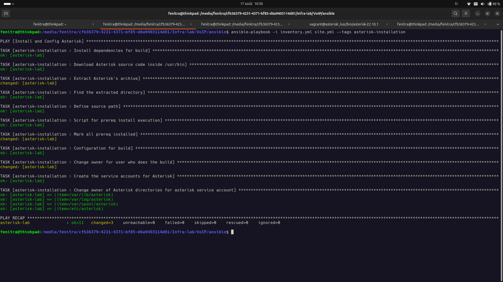
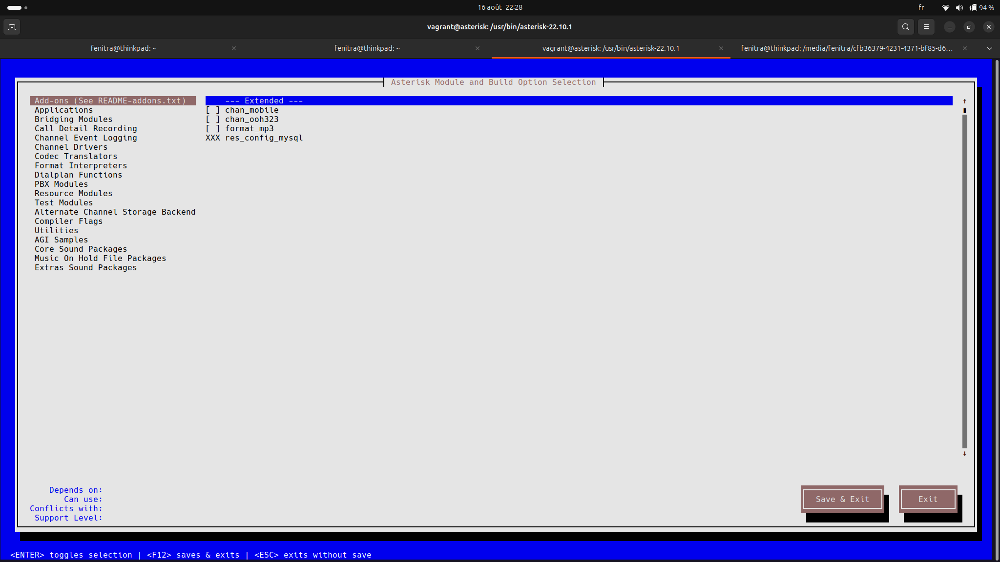
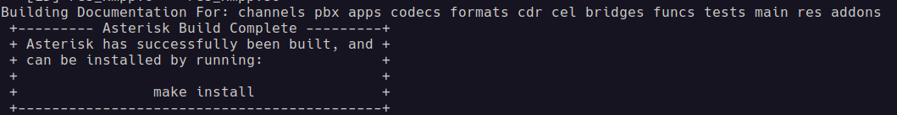
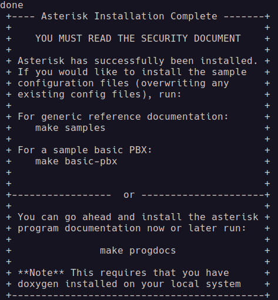
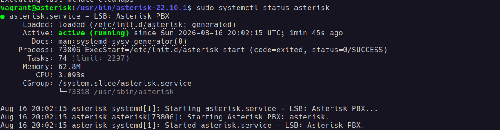
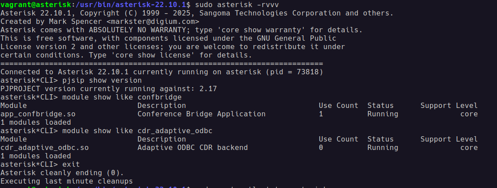

# VoIP project

### Installation and Configuration for Asterisk server

All dependencies installation are done with an `ansible` playbook, just execute the following commands:

```bash
ansible-playbook -i inventory.yml site.yml --tags asterisk-installation
```


After all dependencies installation, it's time to configure our `Asterisk` server using this command and select all of your needed `modules`:
```bash
make menuselect
```


And it's time to build our `Asterisk`:

```bash
make -j$(nproc)
```
It should confirm you with this information:



Install it with the command from the information above:
```bash
sudo make install
```

And like previous, `Asterisk` always send you an aethetics output XD:



Continue the configuration with these commands:
```bash
sudo make samples
sudo make config
```

Right now, you can start your `Asterisk` service:
```bash
sudo systemctl start asterisk
```


If you want to interact with `asterisk*CLI`, just execute this command and use all the commands inside the screenshot for verification:
```bash
sudo asterisk -rvvv
```

